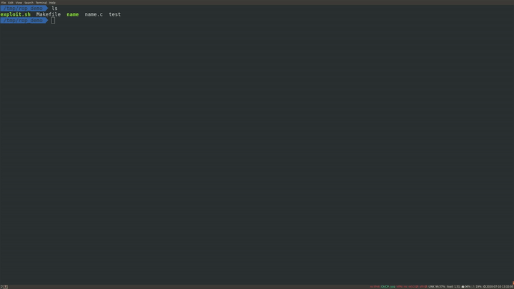

# Chestnut

This is the PoC implementation for the CCSW'21 paper

[Automating Seccomp Filter Generation for Linux Applications](http://cc0x1f.net/publications/chestnut.pdf) by Claudio Canella, Mario Werner, Daniel Gruss, and Michael Schwarz

## Description

Chestnut is a tool that automates sandboxing applications on the system-call level. The compiler extension Sourcealyzer is based on LLVM and statically detects system calls during compilation and linking. Binalyzer can be applied to existing binaries where the source code is not available. Dynalyzer detects system calls during runtime and includes a dynamic permission system that asks a user for confirmation whether the system call should be allowed.

## Prerequsites
For Sourcealyzer, the user needs to patch the LLVM toolchain with the provided patch, which is based on LLVM-10. Once LLVM has been compiled, the user needs to compile the necessary libraries such as musl libc with the new flag *-fautosandbox* to detect all system calls in them. This is also necessary for additional dependencies of applications.

For Binalyzer, it is sufficient to install the required python libraries using pip.

## Demo Videos

We provide several demo videos to show that Chestnut can be used in practice without breaking the functionality of existing applications while significantly increasing the system's overall security by sandboxing applications. For each video, we briefly discuss the setup and the expected outcome under the assumption that Chestnut was able to identify the required system calls correctly.

### Nginx
In this video, we compiled Nginx and its dependencies using Sourcealyzer. We first show that our sandbox is indeed active and the system calls we identified during static analysis. We then execute the testsuite provided by [nginx-tests](https://github.com/nginx/nginx-tests) to show that our application passes all applicable tests as an unsandboxed version of the application would. We note that we only configured Nginx to host a website using SSL; hence, several tests are skipped as they are not applicable, eg., tests for streaming or a mail client. As expected, all tests pass without error, and the dynamic permission system is never triggered as not a single seccomp violation occurred. Finally, we also use the Siege tool to demonstrate further that Nginx can serve requests from 200 threads simultaneously without any errors. All of this indicates that Chestnut was indeed able to identify all required system calls for hosting a static website using SSL.

The video version of the above gif can be found [here](Demo-Videos/nginx_sandboxed.mp4).

### FFMpeg

As the previous video is quite long, we decided to speed it up using FFmpeg. For that, we used a version of FFmpeg that was generated using Sourcealyzer. At the beginning of the video, we show that the executed FFmpeg binary indeed has Chestnut active and the number of detected system calls. Finally, we show that FFmpeg was able to speed up the previous video and that it can be played using vlc. During the whole process, not a single user notification is generated, and FFmpeg can finish its task correctly. This indicates that Sourcealyzer can correctly infer all necessary system calls for this task in FFmpeg and the required codec library.

The video version of the above gif can be found [here](Demo-Videos/ffmpeg_sandboxed.mp4).

### Redis

In this demo video, we used Sourcealyzer on [redis](https://redis.io/) to show that Chestnut does not impede the functionality of it and that Sourcealyzer can identify all necessary system calls, meaning that our dynamic permission system is never triggered during its execution while significantly improving the overall security of the system. To demonstrate this, we execute the included testsuite of Redis, which tests a significant amount of the provided features. As the video shows, our dynamic permission system is never triggered while all tests pass successfully.

The video version of the above gif can be found [here](Demo-Videos/redis_sandboxed.mp4).

### ROP Toy Example

For this demo video, we constructed a simple ROP example. When we execute the program normally, and with valid input, we never trigger the vulnerability (a buffer overflow). When providing the program with the correct payload for the ROP attack, we generate a buffer overflow that results in a new shell being opened. One necessary step in this is that the payload performs an execve system call. The original program has been analyzed and annotated using Binaylzer, and the dynamic permission system is forced to be active. As the video shows, the original program does not allow the execve system call as it does not require it.

Once we start the exploit, a notification from the dynamic permission system pops up. It indicates that a forbidden system call (execve) has been performed and asks the user for permission to continue executing it. By clicking no, the user denies the system call, which results in the application being terminated as it is currently exploited (note that this behavior is implementation-defined and our proof-of-concept simply terminates the application). Hence, the exploit fails, and no new shell is opened.

The video version of the above gif can be found [here](Demo-Videos/toy_rop_sandboxed.mp4).

## Warnings
**Warning #1**: We are providing this code as-is. You are responsible for protecting yourself, your property and data, and others from any risks caused by this code. This code may cause unexpected and undesirable behavior to occur on your machine.

**Warning #2**: This code is only a proof-of-concept and developed for testing purposes. Do not run it on any productive systems. Do not run it on any system that might be used by another person or entity.
